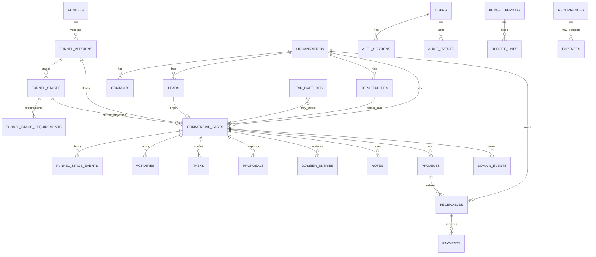

# COAL UP CRM V10.5 — MAPA DE DADOS



## Centro do sistema

```text
Organization / Contact
        ↓
Lead
        ↓
Commercial Case ─── Funnel Version
        │                 ↓
        │             Stage config
        │
        ├── current_stage_id  ← projeção
        ├── next_action_task_id ← verdade do próximo passo
        │
        ├── Stage Events ← histórico real
        ├── Activities
        ├── Evidence
        ├── Notes
        ├── Proposals
        └── Opportunity quando houver fit
```
